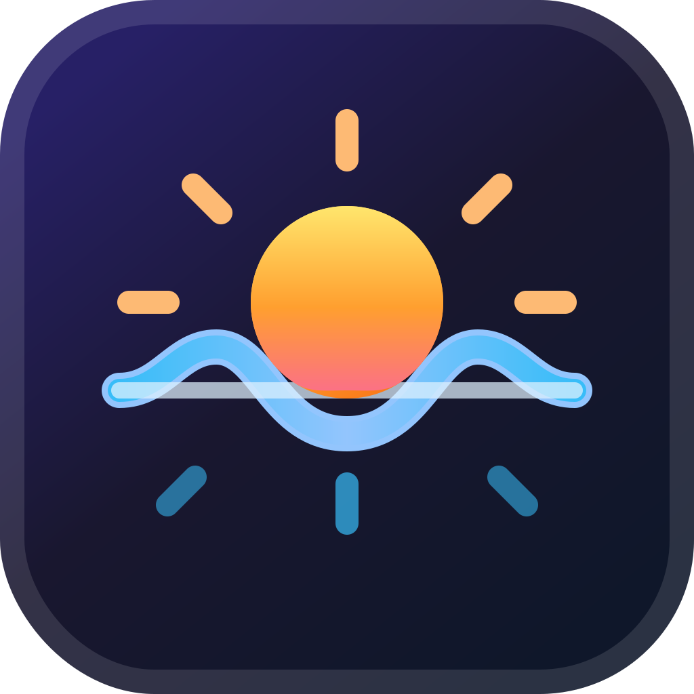
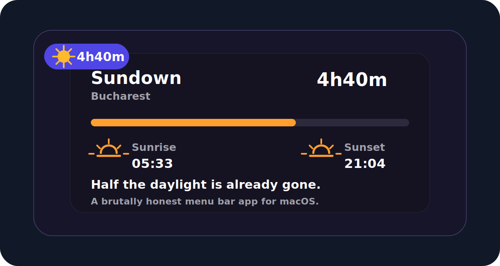

<p align="center">
  
</p>

<p align="center">
  
</p>

# Sundown

Sundown is a brutally honest macOS menu bar app that tells you how much
daylight you have left today.

It is not a calendar. It is not a Pomodoro timer. It does not try to organize
your life. It does one thing: it reminds you that the day ends.

Instead of checking the clock, you see something more visceral:

```text
sun 4h40m
```

## Features

- Menu bar countdown to today's sunset
- Compact dropdown with sunrise, sunset, daylight progress, and a short message
- Manual city entry
- City autocomplete powered by Apple MapKit
- Local sunrise/sunset calculation
- Optional once-a-day notification before sunset
- No account, no backend, no sync, no tracking

## Install

Download the latest notarized release from:

https://github.com/andreicovaciu/sundown/releases

Or install with Homebrew:

```bash
brew install --cask andreicovaciu/tap/sundown
```

## Development

Sundown is a SwiftPM macOS app.

Run tests:

```bash
swift test
```

Local packaging and release scripts are intentionally not committed.

## Privacy

Sundown uses location only to calculate sunrise and sunset on your Mac. It does
not send your location to a Sundown server because there is no Sundown server.
Manual city autocomplete and geocoding use Apple's location services.

## License

MIT. See [LICENSE](LICENSE).
